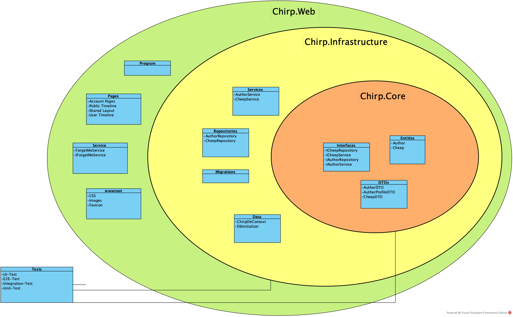
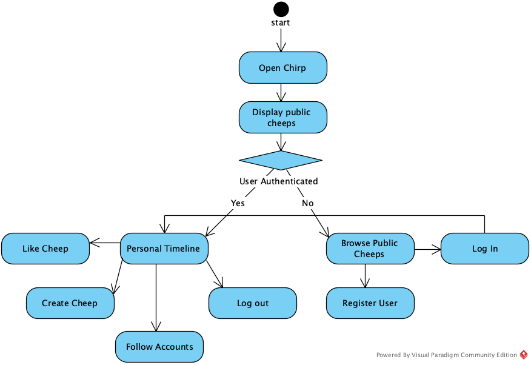
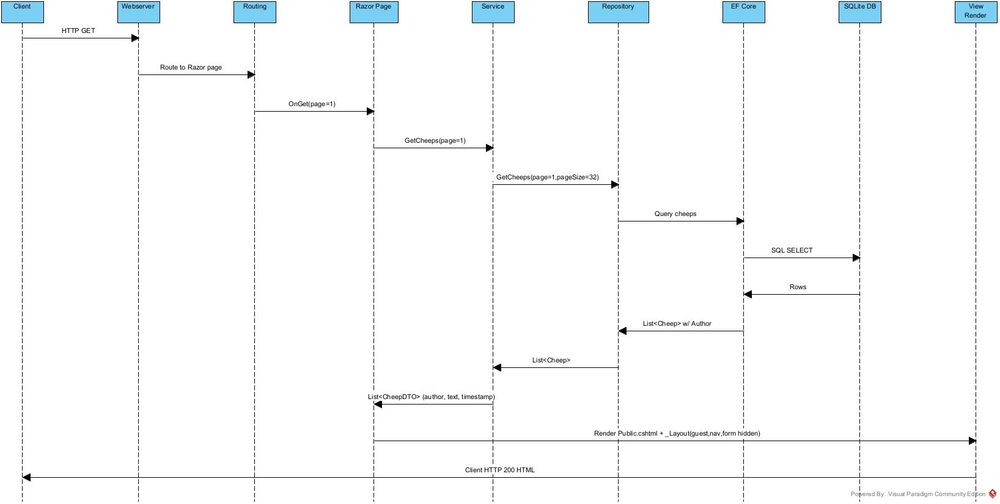
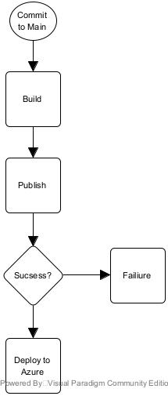
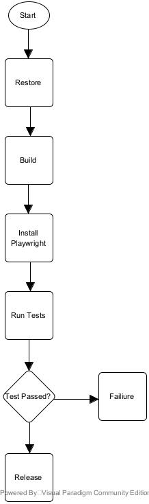

# Design and Architecture of _Chirp!_

## Domain model

_Chirp_ is built on two main entities, which are `Author` and `Cheep`.
-`Author` is representing one of our users on _Chirp_. It's an extension of `ASP.NET Core Identity`, and it enables users to send Cheeps, follow other users and like other cheeps. 
-`Cheep` is representing all of the Cheeps being sent. This contains the specific attributes that make each `Cheep` unique, such as timestamps, text and `Author` of the `Cheep`.

Below is a domain model, documenting the essential concepts of _Chirp_, to create a conceptual framework that accurately describes the structure and dynamic of the program. 


## Architecture — In the small



## Architecture of deployed application


The deployment architecture follows the client - server architecture. Where the Client communicates with the server through HTTPS. The server uses a SQLite database for data storage, and both are hosted on Azure. The server also has two connections with GitHub. One where a workflow is used to deploy the newest code from the "main" branch up to the server, and another by using OAuth to authenticate clients through GitHub login.

## User activities



## Sequence of functionality/calls trough _Chirp!_
A Client sends a HTTP GET / to the Webserver. The Webserver forwards it to Routing, which maps the request on the Razor Page and calls OnGet(page=1). Razor Page then asks Service for data through GetCheeps(page=1,pageSize=32). The Repository uses EF Core to query cheeps; EF Core then issues an SQL SELECT to SQLite DB and gets rows of cheeps back. EF Core returns a List<Cheep> with authors to the Repository which returns it to Service. Service then returns a List<CheepDTO> with author, text and timestamp to the Razor Page. Razor Page then hands the list to View Render which renders Public.cshtml and _Layout and the Webserver returns the rendered HTML as the HTTP response to the Client. 



# Process

## Build, test, release, and deployment


The diagram shows how the code is deployed to Azure. It starts when a pull request is merged into the main branch. Then it builds the project to make sure that it works before it publishes the code. If that succeeds then it will deploy the code to our Azure web server.



The diagram shows how our test and release workflow works. It actually starts by starting three of the same workflow. One for Windows, one for Mac and one for Linux. It all runs in parallel, where it starts by restoring dependencies to make sure it doesn't have anything cached. Then it tries to build the program, if that works it installs playwright, then it starts running all of the tests. If any tests fail it will just terminate and fail the workflow. If not then it publishes and releases the code.

In our repository we have rules that makes sure that this workflow runs and that it succeeds on all three of the operating systems. Only if all of these have succeded, then you can merge the pull request after a code review. 

## Team work
Mostly we're missing a few tests, and at the end of development we noticed that usernames are not unique, and registering with the same username will cause errors with their timelines.


Each week the group would meet to discuss the project work tasks, as well as how the previous ones were implemented. After identifying the described tasks that can be made into issues, they were distributed among members who would fill out the issue template with a user story and acceptance criteria. The members would create a appropriate branch and work on their assigned issue, until meeting again before the next lecture to finish up or inform the others of their progress and when they expect to be finished. When finished they would create a pull request, which would then be reviewed by another member who would either request changes or approve and merge the branch into main.


## How to make _Chirp!_ work locally

1. Clone the repo:
   Requirement: The project is using `.Net 8.0` and therefore required to run the program.
   Clone the repo: 
   `git clone https://github.com/ITU-BDSA2025-GROUP1/Chirp.git`

2. Restore and build:
   `dotnet restore`
   `dotnet build`

3. Configure secrets (local dev)
   - Use dotnet user-secrets (run from the Chirp.Web project folder):
     ```bash
     dotnet user-secrets init --project src/Chirp.Web/Chirp.Web.csproj
     dotnet user-secrets set "authentication:github:clientId" "<GITHUB_CLIENT_ID>"
     dotnet user-secrets set 
     "authentication:github:clientSecret" "<GITHUB_CLIENT_SECRET>"
     ```
   - If you do not set the GitHub secrets, GitHub OAuth will be disabled (the app logs a warning) — safe for local dev.

4. Run the app (HTTPS recommended)
   - Trust dev cert:
     `dotnet dev-certs https --trust`
   - Start the web app:
     `dotnet run --project src/Chirp.Web/Chirp.Web.csproj`
   - By default the app creates a SQLite DB file in:
     - Local dev: {repo-root}/src/Chirp.Web/App_Data/chirp.db
     - Azure App Service: `D:\home\data\chirp.db` (the app writes to `HOME\data` on App Service)
   - On first run the application will apply EF migrations and seed demo data automatically (unless running in the `Testing` environment).


## How to run test suite locally

The project contains Unit-test, integration-tests, end-to-end-tests, and UI-tests.
- Requirements for the UI-tests
  Install Playwright: 
  `playwright install`

- Run tests:
   - From repo root:
     `dotnet test`
   - Run only Playwright UI/E2E tests:
     `dotnet test --filter FullyQualifiedName~CheepUiAndE2ETests`

### Coverage
The test suite is covering a wide range of functionality of the _Chirp_ client, ensuring that the application is reliable, meets user expectations, and is free of bugs. 

**Unit Tests**
UnitTests.cs:
Testing without start a web app/server to make tests to the base functionality of _Chirp_.


**Integration Tests**
IntegrationTests.cs, WebAppFactory.cs, SharedFactoryCollection.cs:
Tests the integration of the app, as a running system, without browser UI. 


**End-to-End Tests**
End2EndTest.cs:
These are simliar to the integration tests, the main difference being that they test the content an user interacts with. 


**UI End-to-End Tests**
CheepUiAndE2ETests.cs, PlaywrightSmokeTests.cs:
With Microsoft.Playwright it imitates a real browser, as an user would see it and starts a server. This is to prove that the system work from the user's perspective. 


# Ethics

## License
We chose to use an MIT license as the project is an open source project that is public on GitHub and can be used by the GitHub users, if they credit us. Besides that, the MIT license is easy to understand, permissive (minimal restrictions) and widely used and known.

## LLMs, ChatGPT, CoPilot, and others
We have used a range of LLMs such as ChatGPT and Claude. We have used LLMs mostly to help debug our code when large errors were hard to understand. It has also been used to make boilerplate code when making a new feature or document. When making GitHub Actions it has also helped by understanding how it works and how to make it work with Azure deployment.

The use of LLMs has overall been quite helpfull in saving time when having to deal with minor problems or bugs, or making some boilerplate code when making new HTML pages as an example. It has also been really helpfull when we have to research a new topic or get a better explaination for something from the lectures. Overall it has sped up our development by saving time in reseaching and debugging.
