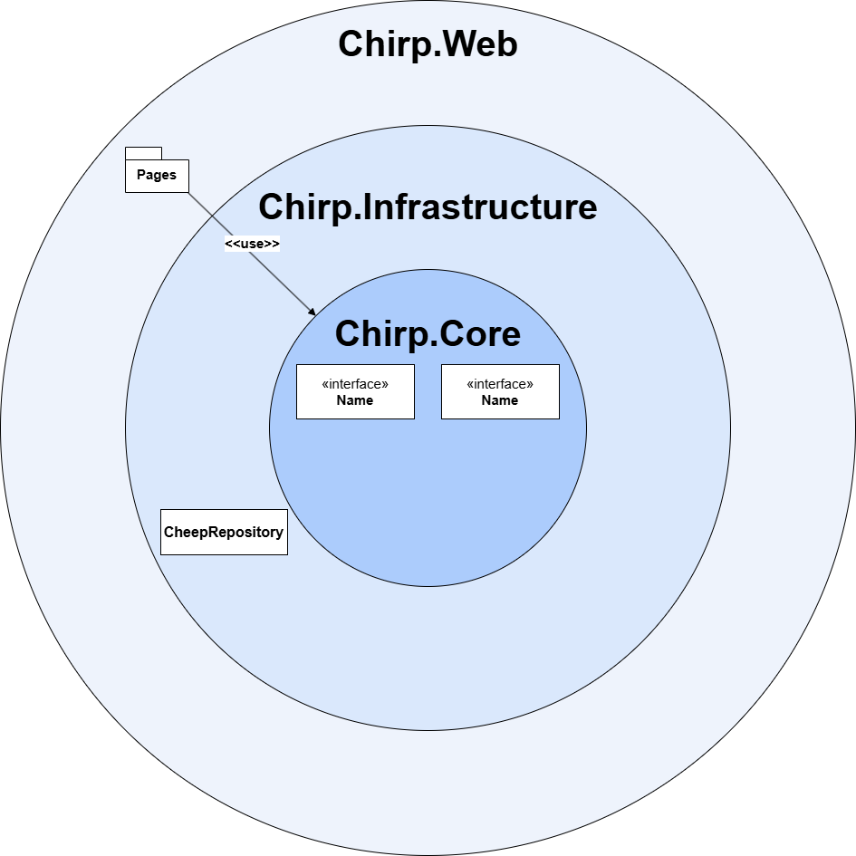

# Design and Architecture of _Chirp!_

## Domain model

_Chirp_ is built on two main entities, which are `Author` and `Cheep`.
-`Author` is representing one of our users on _Chirp_. It's an extension of `ASP.NET Core Identity`, and it enables users to send Cheeps, follow other users and like other cheeps. 
-`Cheep` is representing all of the Cheeps being sent. This contains the specific attributes that make each `Cheep` unique, such as timestamps, text and `Author` of the `Cheep`.

Below is a domain model, documenting the essenential concepts of _Chirp_, to create a conceptual framework that accurately describes the structure and dynamic of the program. 


## Architecture — In the small

## Architecture of deployed application


The deployment architecture follows the client - server architecture. Where the Client communicates with the server through HTTPS. The server uses a SQLite database for data storage, and both are hosted on Azure. The server also has two connections with GitHub. One where a workflow is used to deploy the newest code from the "main" branch up to the server, and another by using OAuth to athenticate clients through GitHub login.

## User activities

## Sequence of functionality/calls trough _Chirp!_

# Process

## Build, test, release, and deployment


The diagram shows how the code is deployed to Azure. It starts when a pull request is merged into the main branch. Then it builds the project to make sure that it works before it publishes the code. If that succeds then it will deploy the code to our Azure web server.


The diagram shows how our test and release workflow works. It actually starts by starting three of the same workflow. One for Windows, one for Mac and one for Linux. It all runs in paralel, where it starts by restoreing dependencies to make sure it doen't have anything cached. Then it tries to build the program, if that works it installs playwright, then it starts running all of the tests. If any tests fail it will just terminate and fail the workflow. If not then it publishes and releases the code.

In our repocetory we have rules that makes sure that this workflow runs and that it succeds on all three of the oberating systems. Only if all of these have succeded, then you can merge the pull request after a code review. 
## Team work
Mostly we're missing a few tests, and at the end of development we noticed that usernames are not unique, and registering with the same username will cause errors with their timelines.

Each week the group would meet to discuss the project work tasks, aswell as how the previous ones were implemented. After identifying the described tasks that can be made into issues, they were distributed among members who would fill out the issue template with a user story and acceptance criteria. The members would create a appropriate branch and work on their assigned issue, until meeting again before the next lecture to finish up or inform the others of their progress and when they expect to be finished. When finished they would create a pull request, which would then be reviewed by another member who would either request changes or approve and merge the branch into main.


## How to make _Chirp!_ work locally

1. Clone the repo:
   Requirement: The project is using `.Net 8.0` and therefore required to run the program.
   Clone the repo: 
   `git clone https://github.com/ITU-BDSA2025-GROUP1/Chirp.git`

2. Restore and build:
   `dotnet restore`
   `dotnet build`

3. Configure secrets (local dev)
   - Use dotnet user-secrets (run from the Chirp.Web project folder):
     ```bash
     dotnet user-secrets init --project src/Chirp.Web/Chirp.Web.csproj
     dotnet user-secrets set "authentication:github:clientId" "<GITHUB_CLIENT_ID>"
     dotnet user-secrets set "authentication:github:clientSecret" "<GITHUB_CLIENT_SECRET>"
     ```
   - If you do not set the GitHub secrets, GitHub OAuth will be disabled (the app logs a warning) — safe for local dev.

4. Run the app (HTTPS recommended)
   - Trust dev cert:
     `dotnet dev-certs https --trust`
   - Start the web app:
     `dotnet run --project src/Chirp.Web/Chirp.Web.csproj`
   - By default the app creates a SQLite DB file in:
     - Local dev: {repo-root}/src/Chirp.Web/App_Data/chirp.db
     - Azure App Service: D:\home\data\chirp.db (the app writes to HOME\data on App Service)
   - On first run the application will apply EF migrations and seed demo data automatically (unless running in the `Testing` environment).


## How to run test suite locally

The project contains Unit-test, integration-tests, end-to-end-tests, and UI-tests.
- Requirements for the UI-tests
  Install Playwright: 
  `playwright install`

- Run tests:
   - From repo root:
     `dotnet test`
   - Run only Playwright UI/E2E tests:
     `dotnet test --filter FullyQualifiedName~CheepUiAndE2ETests`

# Ethics

## License

## LLMs, ChatGPT, CoPilot, and others
